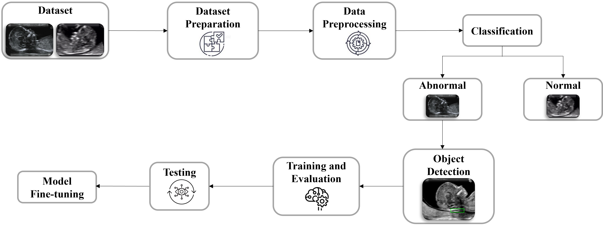
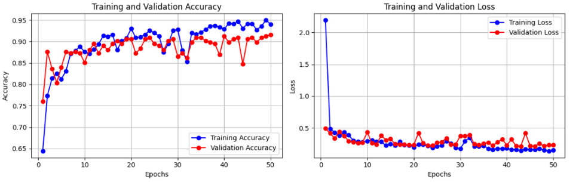
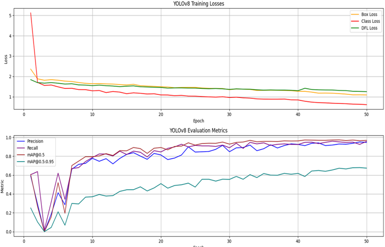
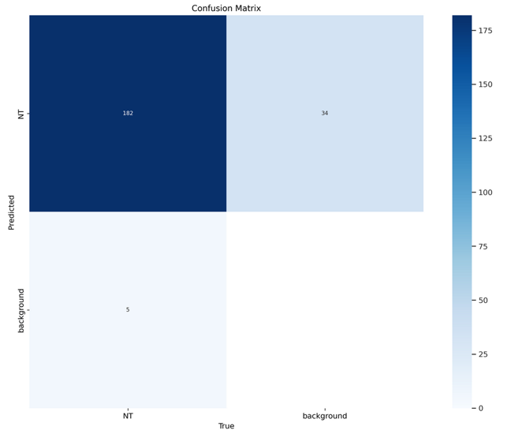
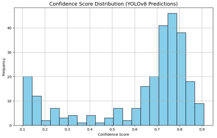
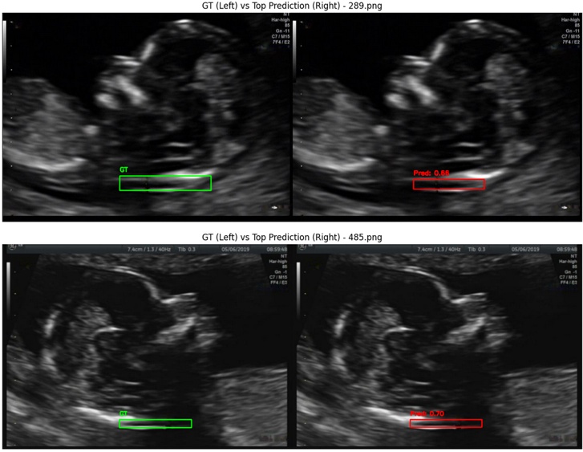
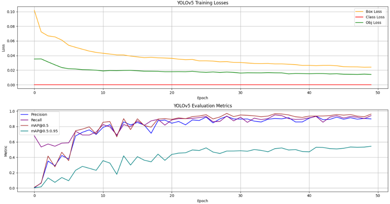

# Deep Learning-Based Classification and Detection of Nuchal Translucency in Prenatal Ultrasound Images

> **A two-stage deep learning pipeline for automated Nuchal Translucency (NT) detection and Down Syndrome risk classification in first-trimester fetal ultrasound images.**

---

## Abstract

Down Syndrome (Trisomy 21) is one of the most common chromosomal abnormalities. Nuchal Translucency (NT) — a fluid-filled space at the back of a fetus's neck — is the standard first-trimester prenatal screening marker, measured via ultrasound between 11–14 weeks of pregnancy. Manual NT assessment is time-consuming, operator-dependent, and inaccessible in resource-limited settings.

This project presents a two-stage deep learning pipeline:

1. **Stage 1 — Classification:** A custom CNN classifies fetal ultrasound planes as *Standard* or *Non-Standard* — **89% accuracy**
2. **Stage 2 — NT Detection:** YOLOv8 object detection localises the NT bounding box — **mAP@0.5: 96.8%, Precision: 94.6%, Recall: 95.7%**

YOLOv8 outperforms YOLOv5 on all detection metrics, and the full pipeline assists clinicians in automated, reproducible prenatal NT assessment.

---

## Methodology



*End-to-end pipeline: Dataset → Preparation → Preprocessing → Classification (Standard/Non-Standard) → Object Detection (NT bounding box) → Training & Evaluation → Testing → Fine-tuning*

---

## Table of Contents

- [Dataset](#dataset)
- [Preprocessing](#preprocessing)
- [Stage 1 — CNN Classification](#stage-1--cnn-classification)
- [Stage 2 — NT Detection](#stage-2--nt-detection)
- [Results](#results)
- [Project Structure](#project-structure)
- [Setup & Installation](#setup--installation)
- [Usage](#usage)
- [Demo / Inference](#demo--inference)
- [References](#references)

---

## Dataset

- **Source:** 2D sagittal-view fetal ultrasound images — Shenzhen People's Hospital
- **Total images:** 1,528 (1,519 pregnant females)
- **Annotations:** `ObjectDetection.xlsx` — bounding box labels for 9 fetal structures including NT, Nasal Bone, Thalami, Midbrain, Palate, 4th Ventricle, Cisterna Magna, Nasal Tip, Nasal Skin
- **External test set:** 156 images — Longhua branch, Shenzhen People's Hospital

### Classification Split

| Class | Images |
|-------|--------|
| Standard | 812 |
| Non-Standard | Variable |
| Internal Test Set | 156 (72 Standard, 84 Non-Standard) |

### Detection Split (NT-annotated images)

| | Count |
|--|-------|
| Total NT-annotated | 1,110 |
| After deduplication | 1,074 |
| Train / Val / Test | 80 : 10 : 10 |

---

## Preprocessing

Applied to all images before training:

| Step | Detail |
|------|--------|
| Grayscale conversion | `cv2.IMREAD_GRAYSCALE` |
| CLAHE enhancement | `clipLimit=2.0`, `tileGridSize=(8×8)` |
| Gaussian denoising | `kernel=(3×3)` |
| Resize | `512×512` px |
| RGB conversion | Grayscale → 3-channel merge |

---

## Stage 1 — CNN Classification

**Task:** Classify ultrasound planes as Standard (normal NT view) or Non-Standard (unusable for NT measurement)

### Model Architecture

```
Input (512, 512, 3)
├── Data Augmentation (RandomFlip, RandomRotation 0.1, RandomZoom 0.1, RandomContrast 0.1)
├── Conv2D(32) → BatchNorm → ReLU → Dropout(0.1) → MaxPool
├── Conv2D(64) → BatchNorm → ReLU → Dropout(0.1) → MaxPool
├── Conv2D(128) → BatchNorm → ReLU → Dropout(0.1) → MaxPool
├── Conv2D(256) → BatchNorm → ReLU → Dropout(0.1) → MaxPool
├── GlobalAveragePooling2D
├── Dense(128) → BatchNorm → ReLU → Dropout(0.4)
└── Dense(2, softmax)

Optimizer : Adam(lr=1e-3, clipvalue=1.0)
Loss      : Categorical Crossentropy
L2 Reg    : 1e-4
Callbacks : EarlyStopping(patience=10), ReduceLROnPlateau(factor=0.5, patience=5)
```

### Training Curves



*Training and validation accuracy converge steadily to ~93% and ~91% respectively over 50 epochs. Loss drops sharply in early epochs and stabilises — no significant overfitting observed.*

### Sample Predictions


*Ground truth (top) vs model predictions (bottom) on Non-Standard ultrasound planes — the model correctly identifies Non-Standard views in both cases.*

### Confusion Matrix


*Out of 156 test images: 73 Non-Standard and 66 Standard correctly classified. 11 Non-Standard misclassified as Standard, 6 Standard misclassified as Non-Standard.*

---

## Stage 2 — NT Detection

**Task:** Detect and localise the Nuchal Translucency region with a bounding box in Standard ultrasound planes

### YOLOv8 Configuration

```
Model     : YOLOv8n (COCO pretrained)
Epochs    : 50  |  imgsz: 640  |  Batch: 32
Confidence: 0.7  |  IoU: 0.75
Class     : NT (single class)
```

### YOLOv8 Training Curves



*YOLOv8 training losses (Box, Class, DFL) converge smoothly. Precision, Recall, and mAP@0.5 all exceed 0.95 by epoch 50. mAP@0.5:0.95 reaches ~0.67.*

### YOLOv8 Confusion Matrix



*182 NT regions correctly detected (True Positive). 5 false negatives (missed NT). 34 background regions flagged — low false positive rate overall.*

### YOLOv8 Precision-Recall Curve


*AUC = 0.99 — near-perfect precision maintained across all recall thresholds, confirming the model's reliability for NT localisation.*

### YOLOv8 Confidence Score Distribution



*Majority of predictions fall in the 0.65–0.85 confidence range, indicating consistent high-confidence detections on the test set.*

### YOLOv8 Predictions — Ground Truth vs Predicted



*Green box: ground truth NT region. Red box: model prediction. The predicted bounding boxes closely align with the ground truth NT regions across both test samples.*

---

### YOLOv5 vs YOLOv8 Comparison



*YOLOv5 training curves for reference — Box Loss, Obj Loss plateau higher than YOLOv8. Precision and Recall reach ~0.90 and ~0.94 respectively.*

---

## Results

### Stage 1 — CNN Classification

| Class | Precision | Recall | F1-Score | Support |
|-------|-----------|--------|----------|---------|
| Non-Standard (0) | 0.92 | 0.87 | 0.90 | 84 |
| Standard (1) | 0.86 | 0.92 | 0.89 | 72 |
| **Overall Accuracy** | | | **0.89** | **156** |
| Macro Average | 0.89 | 0.89 | 0.89 | 156 |

### Stage 2 — YOLOv5 vs YOLOv8

| Metric | YOLOv5 | YOLOv8 |
|--------|--------|--------|
| Precision | 0.899 | **0.946** |
| Recall | 0.942 | **0.957** |
| mAP@0.5 | 0.962 | **0.968** |
| mAP@0.5:0.95 | 0.543 | **0.673** |
| PR Curve AUC | — | **0.99** |

> YOLOv8 outperforms YOLOv5 across all metrics, with a notable +13% gain in mAP@0.5:0.95.

---

## Project Structure

```
down-syndrome-detection/
│
├── down-syndrome-yolo.ipynb        # Stage 2: NT detection (YOLOv8 + YOLOv5)
├── down-syndrome-class.ipynb       # Stage 1: Classification (CNN)
├── data.yaml                       # YOLOv8 dataset config
│
├── assets/                         # Result visualisations
│   ├── Methodology.png
│   ├── Curves.png
│   ├── Class_Pred.png
│   ├── Class_CM.png
│   ├── v8res.png
│   ├── v8CM.png
│   ├── PR_curve.jpg
│   ├── Confidence.png
│   ├── Preds.png
│   └── v5res.png
│
└── README.md
```

---

## Setup & Installation

```bash
git clone https://github.com/<your-username>/down-syndrome-detection.git
cd down-syndrome-detection

pip install ultralytics --upgrade
pip install tensorflow opencv-python matplotlib scikit-learn seaborn tqdm
```

---

## Usage

### Train CNN Classifier
Run all cells in `down-syndrome-class.ipynb`.

### Train YOLOv8 Detector

```python
from ultralytics import YOLO

model = YOLO('yolov8n.pt')
model.train(data="data.yaml", epochs=50, imgsz=640, batch=32, project="NT-Detection")
```

---

## Demo / Inference

### NT Detection

```python
from ultralytics import YOLO
import cv2

model = YOLO("NT-Detection/weights/best.pt")
results = model.predict(source="path/to/ultrasound.png", imgsz=640, conf=0.7, iou=0.75)
for r in results:
    cv2.imshow("NT Detection", r.plot())
    cv2.waitKey(0)
```

### Classification

```python
import tensorflow as tf, cv2, numpy as np

model = tf.keras.models.load_model("cnn_classifier.h5")
img = cv2.imread("path/to/image.png", cv2.IMREAD_GRAYSCALE)
clahe = cv2.createCLAHE(clipLimit=2.0, tileGridSize=(8,8))
img = cv2.resize(cv2.merge([clahe.apply(img)]*3), (512,512))
pred = model.predict(np.expand_dims(img, 0))
print("Standard" if np.argmax(pred) == 1 else "Non-Standard (DS Risk)")
```

---

## References

1. Kasera et al. "Deep-learning computer vision can identify increased nuchal translucency." *Prenatal Diagnosis*, 2024.
2. Reshi et al. "Deep Learning-Based Architecture for Down Syndrome Assessment." *IJERR*, 2024.
3. Thomas & Resmi. "Computational Method of Predicting Down Syndrome on Foetus." *ICSCC*, 2023.
4. Saini. "Enhanced Detection of Down Syndrome Through CNNs." *ICMCSI*, 2025.
5. Gokulakrishnan & Selvakumar. "Detecting Down Syndrome Fetus Images Using Deep Learning." *IJCESE*, 2024.

---

## Author

**Leela Bhargavi N R**
MTech Data Science — Amrita Vishwa Vidyapeetham
[LinkedIn](https://www.linkedin.com/in/leela-bhargavi-n-r/) | leelab1113@gmail.com
